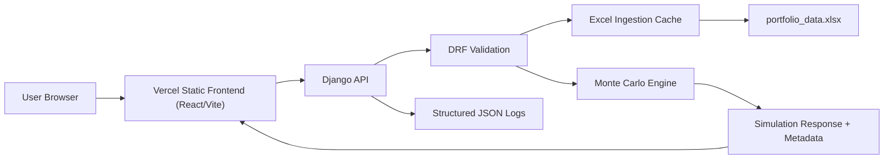

# Architecture

## Current Runtime Architecture

## Backend Components

- `simulation/serializers.py`: request contract and input bounds.
- `simulation/ingestion.py`: workbook parsing and mtime cache.
- `simulation/engine.py`: path generation, cash flows, success criteria, aggregation.
- `simulation/audit.py`: optional expensive mathematical audit.
- `simulation/model_metadata.py`: version, disclaimer, limitations.
- `simulation/logging_utils.py`: request ID middleware and JSON log formatter.
- `simulation/benchmarks.py`: benchmark portfolio and golden test definitions.
- `simulation/views.py`: API orchestration and response metadata.

## Observability

Every HTTP response includes:

- `X-Request-ID`
- `X-Response-Time-Ms`

Every simulation response includes:

- `metadata.request_id`
- `metadata.runtime_ms.simulation`
- `metadata.runtime_ms.total_request`
- `metadata.model_version`
- `metadata.disclaimer`

Logs are structured JSON emitted to stdout/stderr for platform log collection.

## Trust Boundary

The frontend is a client-only analytical interface. The backend is the trust boundary for:

- request validation
- model versioning
- simulation execution
- metadata/disclaimer injection
- rate limiting

The frontend displays disclaimers, but the backend also includes disclaimer metadata so downstream clients cannot bypass trust language accidentally.

## Deployment Shape

The deployment configuration uses a split hosting architecture:

- **Frontend**: Vercel React/Vite static frontend.
  - Vercel hosts the frontend assets only.
  - SPA fallback route is managed via `vercel.json`.
- **Backend**: Railway-hosted Django/DRF API served by Gunicorn.
  - Railway is the active backend deployment path.
  - The start command and build steps are defined in `railway.json`.
- **Workbook**: `backend/simulation/portfolio_data.xlsx` (located on the backend filesystem as the local data source).

*Note: Any past configurations referring to Vercel Python runtime or serverless backend functions are legacy/stale and no longer represent the active deployment architecture.*

## Known Architecture Limits

- Simulations are synchronous.
- CPU-heavy requests compete with normal API traffic.
- Quantitative computing resource limits are governed by the hosting container.

