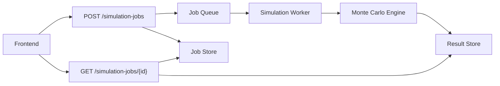

# Scalability Assessment and Async Job Design

## Current Synchronous Architecture

Current flow:

```text
HTTP request -> validate -> parse cached assumptions -> run Monte Carlo -> return response
```

Strengths:

- simple
- easy to demo
- deterministic fixed-seed behavior
- low operational complexity

Risks:

- CPU-heavy simulation blocks request handling
- long requests are vulnerable to platform timeouts
- hard to retry safely
- difficult to cancel
- no durable result store
- no queue-level backpressure
- serverless functions are not ideal for sustained numerical workloads

## Recommended Async Architecture



## API Design

Create job:

```text
POST /simulation-jobs
```

Response:

```json
{
  "job_id": "uuid",
  "status": "queued",
  "request_id": "uuid",
  "model_version": "2026.06.09-v1"
}
```

Get status/result:

```text
GET /simulation-jobs/{job_id}
```

Statuses:

- `queued`
- `running`
- `succeeded`
- `failed`
- `cancelled`

## Data Model

Simulation job record:

- `id`
- `request_hash`
- `payload`
- `status`
- `model_version`
- `schema_version`
- `created_at`
- `started_at`
- `completed_at`
- `runtime_ms`
- `error`
- `result_location`
- `request_id`

## Worker Responsibilities

- fetch queued jobs
- validate payload again
- run simulation
- write result
- emit structured logs
- update status
- enforce runtime limits
- mark failures with error class and request ID

## Backpressure Controls

- per-user quota
- per-IP quota
- max concurrent jobs
- max trials by account tier
- max years by account tier
- queue length alarms
- worker autoscaling

## Storage Recommendations

For a credible production platform:

- Postgres for job metadata
- Redis/SQS/Celery/RQ for queue
- object storage for large result payloads
- containerized workers for NumPy/Pandas workloads

## Migration Plan

Phase 1:

- add job table
- keep synchronous endpoint
- add async endpoint behind feature flag

Phase 2:

- frontend submits async jobs for high trial counts
- synchronous endpoint remains for small demo requests

Phase 3:

- move all simulations to workers
- add saved scenarios and result history
- add cancellation and retry controls

## Do Not Implement Yet

This document is implementation-ready design. The current task explicitly does not require building the async job system.
